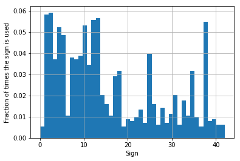
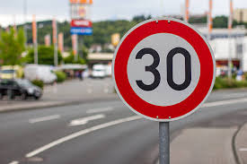
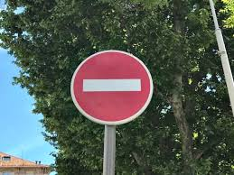
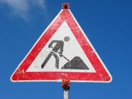
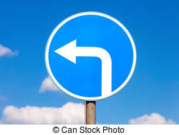

# **Traffic Sign Recognition** 

## Writeup

### You can use this file as a template for your writeup if you want to submit it as a markdown file, but feel free to use some other method and submit a pdf if you prefer.

---

**Build a Traffic Sign Recognition Project**

The goals / steps of this project are the following:
* Load the data set (see below for links to the project data set)
* Explore, summarize and visualize the data set
* Design, train and test a model architecture
* Use the model to make predictions on new images
* Analyze the softmax probabilities of the new images
* Summarize the results with a written report

[//]: # (Image References)

[image1]: ./examples/visualization.jpg "Visualization"
[image2]: ./examples/grayscale.jpg "Grayscaling"
[image3]: ./examples/random_noise.jpg "Random Noise"
[image4]: ./examples/placeholder.png "Traffic Sign 1"
[image5]: ./examples/placeholder.png "Traffic Sign 2"
[image6]: ./examples/placeholder.png "Traffic Sign 3"
[image7]: ./examples/placeholder.png "Traffic Sign 4"
[image8]: ./examples/placeholder.png "Traffic Sign 5"

## Rubric Points
### Here I will consider the [rubric points](https://review.udacity.com/#!/rubrics/481/view) individually and describe how I addressed each point in my implementation.  

---
### Writeup / README

#### 1. Provide a Writeup / README that includes all the rubric points and how you addressed each one. You can submit your writeup as markdown or pdf. You can use this template as a guide for writing the report. The submission includes the project code.

You're reading it! and here is a link to my [project code](https://github.com/udacity/CarND-Traffic-Sign-Classifier-Project/blob/master/Traffic_Sign_Classifier.ipynb)

### Data Set Summary & Exploration

#### 1. Provide a basic summary of the data set. In the code, the analysis should be done using python, numpy and/or pandas methods rather than hardcoding results manually.

I used the numpy library to calculate summary statistics of the traffic
signs data set:

* The size of training set is 34799
* The size of the validation set is 4410
* The size of test set is 12630
* The shape of a traffic sign image is (32,32,3)
* The number of unique classes/labels in the data set is 43

#### 2. Include an exploratory visualization of the dataset.

Here is an exploratory visualization of the data set. It is a bar chart showing the fraction of the different traffic signs that are used in this data set.

### Design and Test a Model Architecture

#### 1. Describe how you preprocessed the image data. What techniques were chosen and why did you choose these techniques? Consider including images showing the output of each preprocessing technique. Pre-processing refers to techniques such as converting to grayscale, normalization, etc. (OPTIONAL: As described in the "Stand Out Suggestions" part of the rubric, if you generated additional data for training, describe why you decided to generate additional data, how you generated the data, and provide example images of the additional data. Then describe the characteristics of the augmented training set like number of images in the set, number of images for each class, etc.)

I decided to only do normalization to standardize the inputs and also so it becomes easier to find the global minimum. I believe grayscale might be bad for the performance because some important information will go missing if a traffic sign is represented in black and white instead of with colors.

However to make the model better I would have added some noise to the data so that it hopefully would have gotten a better performance.

#### 2. Describe what your final model architecture looks like including model type, layers, layer sizes, connectivity, etc.) Consider including a diagram and/or table describing the final model.

My final model consisted of the following layers:

| Layer         		|     Description	        					| 
|:---------------------:|:---------------------------------------------:| 
| Input         		| 32x32x3 RGB image   							| 
| Convolution 5x5     	| 1x1 stride, same padding, outputs 28x28x64 	|
| RELU					|
| Dropout layer		|												|
| Max pooling	      	| 2x2 stride,  outputs 14x14x12 				|
| Convolution 5x5	    | 1x1 stride, valid padding, outputs 10x10x25
| Relu
| Dropout
|Max pooling | 2x2 stride, outputs 5x5x25
| Flatten | Outputs 625     				
| Fully connected | Inputs 625, outputs 200
| Relu |
| Fully connected | Inputs 200, outputs 100
| Relu |
| Fully connected | Inputs 100, outputs 43
| Softmax				| 
 

#### 3. Describe how you trained your model. The discussion can include the type of optimizer, the batch size, number of epochs and any hyperparameters such as learning rate.

To train the model I used the following hyperparameters:

Learning rate: 0.00075
Epochs: 500
Batch size: 256
Probability of dropout: 0.5
Optimizer: AdamOptimizer

The big difference between my model and the LeNet model is that I have used dropout layers and that my images has 3 layers instead of grayscale images.

#### 4. Describe the approach taken for finding a solution and getting the validation set accuracy to be at least 0.93. Include in the discussion the results on the training, validation and test sets and where in the code these were calculated. Your approach may have been an iterative process, in which case, outline the steps you took to get to the final solution and why you chose those steps. Perhaps your solution involved an already well known implementation or architecture. In this case, discuss why you think the architecture is suitable for the current problem.

My final model results were:
* training set accuracy of 1.000
* validation set accuracy of 0.940 
* test set accuracy of 0.937

If an iterative approach was chosen:
* What was the first architecture that was tried and why was it chosen?
	* LeNet, mostly because it was described in the training material and also because it has a proven track-record on traffic signs.
* What were some problems with the initial architecture?
	* I did not get very good results and I think it was because the number of epochs was low, most likely due to prevent overfitting.	
* How was the architecture adjusted and why was it adjusted? Typical adjustments could include choosing a different model architecture, adding or taking away layers (pooling, dropout, convolution, etc), using an activation function or changing the activation function. One common justification for adjusting an architecture would be due to overfitting or underfitting. A high accuracy on the training set but low accuracy on the validation set indicates over fitting; a low accuracy on both sets indicates under fitting.
	* I added more epochs and to prevent getting overfitting due to this I also added dropout layers first I tried with a dropout probability of 0.25 but this did not give me any good result so instead I used 0.5 which gave me very good result. The convolution layers was slightly changed and I added more units in the fully connected layers. The learning rate was chosen rather small to 0.001 also to reduce overfitting . 

### Test a Model on New Images

#### 1. Choose five German traffic signs found on the web and provide them in the report. For each image, discuss what quality or qualities might be difficult to classify.

Here are five German traffic signs that I found on the web:

   
 

The first two images might be harder to identify because there are lot of other things in the image and the signs are rather small.

The third image should be rather easy to classify since it is very clear however it has some scratches but I don't think it should effect the performance.

The last two look almost animated and they contain almost no noise, the last one has some clouds in the background that could possibly make it harder to classify.

#### 2. Discuss the model's predictions on these new traffic signs and compare the results to predicting on the test set. At a minimum, discuss what the predictions were, the accuracy on these new predictions, and compare the accuracy to the accuracy on the test set (OPTIONAL: Discuss the results in more detail as described in the "Stand Out Suggestions" part of the rubric).

Here are the results of the prediction:

| Image			        |     Prediction	        					| 
|:---------------------:|:---------------------------------------------:| 
| Turn right ahead      		| Turn right ahead   									| 
| No entry     			| Priority road 										|
| Turn left ahead					| Turn left ahead											|
| Speed limit (30km/h)	      		| Priority road					 				|
| Road work			| Road work      							|

The model was able to correctly guess 3 of the 5 traffic signs, which gives an accuracy of 60%. This is worse then the test performance of 93.7%. This is most likely due to the images contain more things than only traffic signs.

#### 3. Describe how certain the model is when predicting on each of the five new images by looking at the softmax probabilities for each prediction. Provide the top 5 softmax probabilities for each image along with the sign type of each probability. (OPTIONAL: as described in the "Stand Out Suggestions" part of the rubric, visualizations can also be provided such as bar charts)

The code for making predictions on my final model is located in the 123th cell of the Ipython notebook.

| Probability         	|     Prediction	        					| 
|:---------------------:|:---------------------------------------------:| 
| 9.99998450e-01	         			| Turn right ahead (30km/h)   									| 
| 1.51325060e-06     				| Right-of-way at the next intersection 										|
| 1.15496571e-10					| General caution											|
| 1.76807180e-11	      			| Speed limit (100km/h)					 				|
| 4.41809306e-12			    | Double curve      							|

For the second image the results can be seen below:

| Probability         	|     Prediction	        					| 
|:---------------------:|:---------------------------------------------:| 
| 3.51341158e-01        			| End of all speed and passing limits   									| 
| 2.88249910e-01     				| No passing 										|
| 1.18315071e-01					| Speed limit (60km/h)											|
| 7.16923252e-02	      			| No passing for vehicles over 3.5 metric tons					 				|
| 2.71739811e-02				    | Speed limit (80km/h)      							|

### (Optional) Visualizing the Neural Network (See Step 4 of the Ipython notebook for more details)
#### 1. Discuss the visual output of your trained network's feature maps. What characteristics did the neural network use to make classifications?

